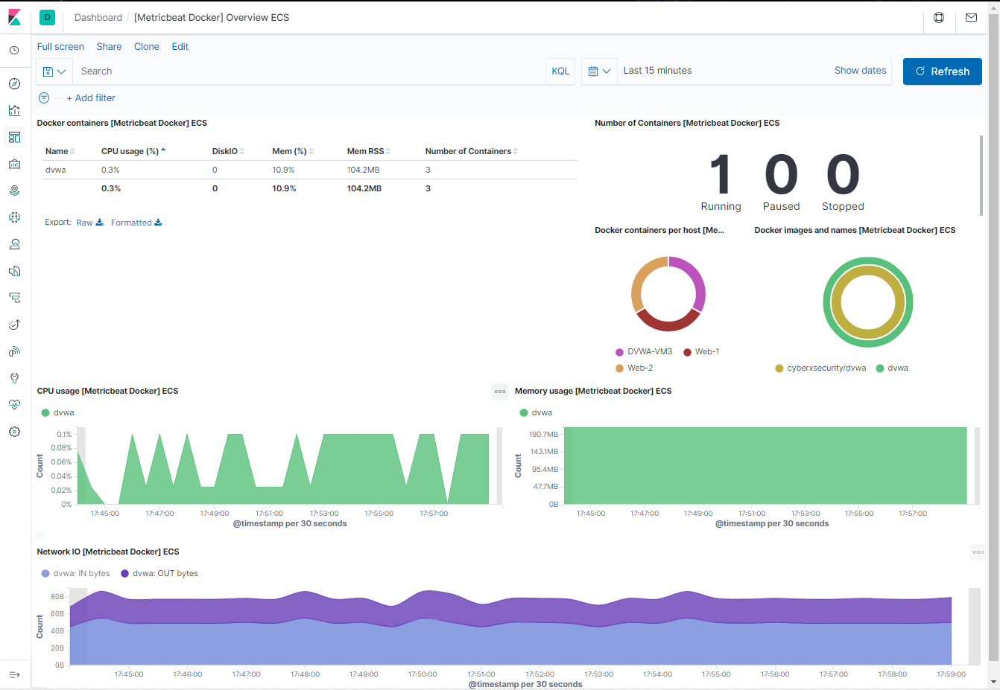

## Automated ELK Stack Deployment

The files in this repository were used to configure the network depicted below.

These files have been tested and used to generate a live ELK deployment on Azure. They can be used to either recreate the entire deployment pictured above. Alternatively, select portions of the .yml file may be used to install only certain pieces of it, such as Filebeat.

  - [DVWA Deployment playbook](Resources/dvwa-playbook.yml)
  - [ELK Deployment playbook](Resources/elk-playbook.yml)
  - [Filebeat Deployment playbook](Resources/filebeat-playbook.yml)
  - [Metricbeat Deployment playbook](Resources/metricbeat-playbook.yml)

This document contains the following details:
- Description of the Topology
- Access Policies
- ELK Configuration
  - Beats in Use
  - Machines Being Monitored
- How to Use the Ansible Build
 
 

### <u> Description of the Topology </u>

The main purpose of this network is to expose a load-balanced and monitored instance of DVWA, the D*mn Vulnerable Web Application.

Load balancing ensures that the application will be highly avaliable, in addition to restricting access to the network.

- A Load balancer is meant to serve the incoming traffic. It act as a specific point of access for a service that is served by multiple machines. This allows availability model to function properly.
- A jumpbox server serves as a gateway to connect to the data servers. This way, data servers are not directly exposed to the public. Only the designated administrator can access through SSH (and this is also restricted to a designated administrator by creating the firewall rule (Network Security Group))
  
    - In a jumpbox VM, A docker container with Ansible is used as a central point to deploy infrastructure-as-code (IaC) configuration sets to web and Elk servers. Deployment is done using SSH, which uses RSA Key-pair created under the root user in the Ansible container. The Web and Elk servers were built using the public key from the Ansible root user and is the only means of connecting to the servers to ensure that there is no manual installation and configuration of applications and system settings on the servers in this Architecture. Refer to the [Architecture Diagram](Images/ProjectDiagram.png) for a visual guide.

Integrating an ELK server allows users to easily monitor the vulnerable VMs for changes to the log files and system resources.

- Filebeat watches for change in system logs and forwards any changes to the Elasticsearch Host
- Metricbeat is used only for gathering metrics and system resources usage to display in Elasticsearch.

Since this project is done through the free 30 day trial of Azure account, it has a limitation of 4 VMs per region. Therefore, Elk Server is deployed on a different region and peering connection is created between 2 different virtual networks in different region. 
   - 
   - 

With the Elk server on a different region, a new firewall rule (Network Security Group) is also created for this specific Elk server so that the only designated personnel can access the Elk server.
  

 

The configuration details of each machine may be found below.

| Name         | Function   | IP Address|Operating System |
|:------------:|:----------:|:---------:|:---------------:|
| Jump Box     | Gateway    | 10.0.0.4  | Linux / Ubuntu  |
| Web-1 VM     | Web Server | 10.0.0.5  | Linux / Ubuntu  |
|    Web-2 VM  | Web Server | 10.0.0.6  | Linux / Ubuntu  |
|   DVWA-VM3   | Web Server | 10.0.0.7  | Linux / Ubuntu  |
| ElkServer VM | ELK Server | 10.1.0.4  | Linux / Ubuntu  |

 
 

### <u> Access Policies </u>

The machines on the internal network are not exposed to the public Internet. 

Only the jumpbox machine can accept connections from the Internet. Access to this machine is only allowed from the Public IP address of the Administrator (**which is the author of this Project: Sooji Lee**)

#### Machines within the network can only be accessed by Jumpbox.
- Configuration of the ElkServer VM could be done through Jumpbox via ssh
- Kibana could be accessed through Administrator's public IP (Whitelisted)
- *Jumpbox*
  - Public IP: 13.91.254.174
  - PrivateIP: 10.0.0.4
- *ElkServer VM*
  - Public IP: 51.143.5.106
  - PrivateIP: 10.1.0.4

A summary of the access policies in place can be found in the table below.  
*Please note that the Administrator's Public IP was allowed through Network Securigy Group (NSG) configuration setting*

| Name     | Publicly Accessible | Allowed IP Addresses |
|:--------:|:-------------------:|:--------------------:|
| Jump Box | Yes (SSH)           | Administrator's Public IP   |
| Web-1 VM |     No              |          None        |
| Web-2 VM |        No           |          None        |
| DVWA-VM3 |          No         |          None        |
| LoadBalancer |    Yes (HTTP)   |  Administrator's Public IP  |
| ElkServer VM |  Yes (KIBANA)   |  Administrator's Public IP  |

 
 

### <u> Elk Configuration </u>

Ansible was used to automate configuration of the ELK machine. No configuration was performed manually, which is advantageous because
- This allowed for automation of deploying of a container.
- By deploying container you need with automation, you can reduce any human error
- Also, you can save time by deploying multiple containers at once.

The playbook implements the following tasks:
- Install Docker: installs the docker engine to be run on the Data Server
- Install Docker container: Installs container using Docker. Also uses the image of the file to install specific container admin is looking for.
- Increase Memory/Use More Memory: When installing ELK Docker with the image, it needs enough memory to function well. This helps fix the issue of not enough memory and allows the server to launch with no problem.

The following screenshot displays the result of running `docker ps` after successfully configuring the ELK instance.

 
 

### <u> Target Machines & Beats </u>
This ELK server is configured to monitor the following machines:
- Webserver machines with following IPs:
  - 10.0.0.5
  - 10.0.0.6
  - 10.0.0.7

We have installed the following Beats on these machines:
- All the Webserver machines were installed with Filebeat & Metricbeat:
  - Web-1 VM
  - Web-2 VM
  - DVWA-VM3

These Beats allow us to collect the following information from each machine:
- Filebeat collects system logs such as login events to see who has actively logged into the system.
- Metricbeat collects metric information such as CPU usage and memory. This is useful to see if there are any behaviours with system resources.

 
 

### <u> Using the Playbook </u>
In order to use the playbook, you will need to have an Ansible control node already configured. Assuming you have such a control node provisioned: 

SSH into the control node and follow the steps below:
- Copy the [elk-playbook.yml](Resources/elk-playbook.yml) file to `/etc/ansible/roles/elk-playbook.yml`.
- Update the hosts file to include the IP of the webservers & elk servers.
- Run the playbook, and navigate to `http://<your_elk_server_ip>:5601/app/kibana` to check that the installation worked as expected.

 
 

### <u> Elk server - Filebeat & Metricbeat </u>
Once the Elk GUI, Kibana is connected, we would need to add the log & metric data. 
   

- Save the [filebeat-config.yml](Resources/filebeat-config.yml) & [metricbeat-config.yml](Resources/metricbeat-config.yml) files to `/etc/ansible/files/filebeat-config.yml` & `/etc/ansible/files/metricbeat-config.yml`.
- Run the [filebeat-playbook.yml](Resources/filebeat-playbook.yml) & [metricbeat-playbook.yml](Resources/metricbeat-playbook.yml).
- After the playbook completes, navigate back to the beats installation page on Kibana, and click on the `Check Data` on Step 5: Module Status to confirm that the installtion was successful.
  - 
  - 

- Once the logs and metrics are congifured, I'm now ready to monitor, troubleshoot and secure the Infrastructure that's created within the scope of this Project.

 
 

### <u> Author </u>
My name is [Sooji Lee](https://www.linkedin.com/in/soojilee88/) :)
